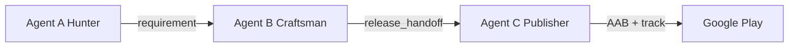

# Agent C — Android Publisher Architecture

Agent C is the **release publisher** in the Hunter–Craftsman pipeline. It owns everything after Agent B finishes implementation: **Gradle release build**, **signing**, and **Google Play upload**.

## Three-agent split



| Agent | Responsibility | Stops at |
|-------|----------------|----------|
| **A (Hunter)** | Opportunity discovery, blueprint, requirement | Sends requirement to B |
| **B (Craftsman)** | Scaffold, codegen, verify, store metadata, demo artifacts | `implementation_complete` + `release_handoff` |
| **C (Publisher)** | `bundleRelease`, keystore signing, Play API upload | `dry_run_complete` or `published` |

Agent B **does not** produce a release AAB. Verify gates for Android only check project structure and compile success. AAB creation is exclusively Agent C.

## Module layout (`craftsman/publisher/`)

| Module | Role |
|--------|------|
| `handoff.py` | Resolve `project_path`, `workspace`, `application_id` from `release_handoff` URIs |
| `android_signing.py` | Write `keystore.properties` from secrets |
| `android_build.py` | Gradle wrapper + `bundleRelease` (or dry-run synthetic AAB) |
| `play_store.py` | Google Play upload (dry-run default; live needs service account) |
| `orchestrator.py` | `run_android_release()` — validate → sign → build → upload |

## API surface (Craftsman)

| Endpoint | Purpose |
|----------|---------|
| `POST /v1/releases/prepare` | Policy check + store handoff |
| `POST /v1/releases/{id}/approve` | Human approval checkpoint |
| `POST /v1/releases/{id}/submit` | **Invokes Agent C** for Android |
| `GET /v1/releases/{id}` | Status including `agent_c_status` |

## End-to-end CLI (Hunter)

```powershell
# A → B only (default)
hunter run "做一个离线番茄钟"

# A → B → C (dry-run publish on Windows)
hunter run "做一个离线番茄钟" --publish

# Require manual approval before submit
hunter run "..." --publish --no-auto-approve
```

Hunter calls `integrations/publisher.py`: prepare → approve (optional) → submit.

## Configuration

Craftsman `.env`:

```env
PUBLISHER_DRY_RUN=true          # default: simulate build/upload
ANDROID_RELEASE_TRACK=internal  # Play track
RELEASE_REQUIRE_HUMAN_APPROVAL=true
RELEASE_REQUIRE_POLICY_CHECKS=true

# Live signing (optional in dry-run)
ANDROID_KEYSTORE_PATH=./secrets/release.jks
ANDROID_KEYSTORE_PASSWORD=...
ANDROID_KEY_ALIAS=...
ANDROID_KEY_PASSWORD=...

# Live Play upload
GOOGLE_PLAY_SERVICE_ACCOUNT_JSON={"type":"service_account",...}
# or GOOGLE_PLAY_SERVICE_ACCOUNT_FILE=./secrets/play-sa.json
PUBLISHER_DRY_RUN=false
```

## Platform notes

- **Windows**: Full A→B→C dry-run path works without Android SDK (synthetic AAB zip).
- **Live build**: Install JDK + Android SDK; Gradle wrapper is bundled in the android template.
- **Live upload**: Requires `GOOGLE_PLAY_SERVICE_ACCOUNT_FILE` and `pip install -e ".[publish]"`; uses Play Edits API (listing + bundle + track + commit).
- **iOS**: Agent C returns `platform_unavailable`; iOS release remains a future Mac/Xcode track.

## Status values

| `agent_c_status` | Meaning |
|------------------|---------|
| `dry_run_complete` | Build/upload simulated successfully |
| `submitted` | Live upload succeeded |
| `failed` | Validation, build, or upload error |
