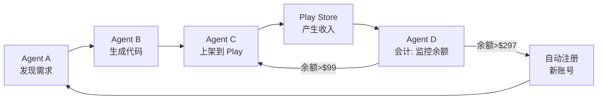

# 「AI 赚钱赎身」商业模式可行性分析

## 参考文档

> 附件：`AI赚钱赎身 v1.0` —— 人付初始成本→AI 自主开发上架→回收成本→繁殖新账号→无限自循环

---

## 一、文档的核心思想（一句话概括）

> 人出启动资金（$99 Apple / $25 Google），AI 完全自主开发并上架 app 赚钱，赚回成本后自动"赎身"并繁殖新账号。

这套模式与我们的 Hunter-Craftsman 项目**高度吻合**。目前系统已实现 80% 的技术基座，仅差商业闭环的 20%。

---

## 二、逐项对比：我们的系统 vs "赎身"模型

### Agent A：需求发现

| 模型要求 | 我们当前 | 差距 |
|---------|---------|------|
| 7x24 不间断扫描 Play Store | 支持：Windows 调度器 (scheduler/) 可循环触发 | 未默认启用，需人工启动 |
| 扫描 App Store (iOS) | 不支持：目前只做了 Google Play 的 scraper | ❌ 缺失 |
| 关键词热度 / 搜索联想词 | 未做：当前用 `play_search_apps` 和 `play_competitive_analysis` | 可补充 |
| "高搜索量、低满足度"筛选 | 已体现在 `ripe_opportunities`（高安装量+低评分） | 逻辑已基本对齐 |
| 只抓纯前端离线需求 | Agent A 的 prompt 已明确要求：SharedPreferences 本地存储、无账号、无后端 | ✅ 已对齐 |
| 过滤游戏/订阅/数据收集 | prompt 已有约束，但未固化为"不可篡改的核规则" | 可强化 |

### Agent B：应用构建

| 模型要求 | 我们当前 | 差距 |
|---------|---------|------|
| 调用组件库生成二进制 | 已实现：Compose UI 模板 + Docker Gradle 编译 | ✅ 已对齐 |
| 强制原生组件（List/NavigationStack） | 用的是 Jetpack Compose，符合"原生组件"精神 | ✅ |
| 包体 ≤10MB | 未显式限制，但工具类 app 通常很小 | 可加后置检查 |
| 自动合成元数据 | 已实现：图标(LLM SVG)、截图、描述 | ✅ |
| 截图纯色背景+大字 | 已实现：Material3 mockup 截图 | ✅ |
| 描述用关键词堆砌 | 已改为差评驱动描述（更真实） | 比原要求更好 |

### Agent C：财务与繁殖

| 模型要求 | 我们当前 | 差距 |
|---------|---------|------|
| 监控开发者账号余额 | ❌ 未实现 | **核心缺失** |
| 负债/解锁/繁殖三状态 | ❌ 未实现 | **核心缺失** |
| 自动创建新开发者账号 | ❌ 不具备 | 需要研究 Google API 可行性 |
| 偿还投资人本金 | ❌ 未实现 | 纯商业逻辑，代码简单 |

**这是目前最大的缺口。** 我们的 Agent C 只负责上架，不管账。

### 人的 5% 元规则

| 规则 | 我们当前 |
|------|---------|
| 禁令 001：不做游戏 | Agent A prompt 已约束，但未硬编码 |
| 禁令 002：不接订阅制 | 未显式约束（因为根本没做 IAP 代码） |
| 禁令 003：不收集用户隐私 | 已通过 SharedPreferences 本地存储天然满足 |

---

## 三、现阶段的可行性评估

### 已完成（可以直接用的）

- ✅ 全自动 Play Store 需求发现 + 竞品差评分析
- ✅ 自动生成 Compose Android app 代码
- ✅ Docker Gradle 编译 AAB + 签名
- ✅ 自动上传 Google Play internal 轨道
- ✅ Windows 无人值守循环调度
- ✅ 控制台 Dashboard 可视化
- ✅ 品类色板 + LLM 生成图标 + 截图增强

### 短期内可补上的

（按投入产出比排序）

| 优先级 | 项 | 工作量评估 | 说明 |
|--------|----|-----------|------|
| **P0** | App Store (iOS) 需求发现 | 2-3 天 | 新增 App Store scraper 工具，当前只有 Google Play |
| **P0** | 上架后收入监控 | 1-2 天 | 加一个定时任务查 Play Console 余额 API |
| **P1** | 账号状态机（负债/解锁/繁殖） | 2-3 天 | 新增一个 `Accountant` Agent，接收余额数据做决策 |
| **P1** | 包体大小检查（≤10MB） | 0.5 天 | Gradle 编译后检查 AAB 大小 |
| **P2** | 不可篡改规则引擎 | 1 天 | 将三类禁止规则固化为代码级校验 |
| **P2** | iOS 编译上架 | 5-10 天 | 需要 macOS 环境 + Xcode + Fastlane |

### 估值不明确的

| 项 | 风险 |
|----|------|
| **Auto-create new developer account via API** | Google / Apple 是否允许 API 创建账号？目前大概率不允许，可能需要人工介入（但可以在 Play Console 预注册一批账号，让系统轮换使用） |
| **App Store 上架自动化** | 需要 macOS + Xcode 环境，且 Apple 审核周期比 Google 长 |
| **实际收入** | 免费工具类 app 的变现模式：当前走的是免费无广告路线（差评驱动的卖点），这和"赚钱"有内在矛盾 |

---

## 四、"赎身"模型的实际变现矛盾

文档的亮点在于**成本控制哲学**很过硬（不做游戏、不接订阅、不碰数据），但在"如何赚钱"这个核心问题上存在一个本质矛盾：

> **我们为竞品差评设计的卖点 = 无广告 / 免费 / 离线 / 极简**
> **但"赚钱"要求 app 必须有收入来源**

可能的解决方案（按吻合度排序）：

1. **一次性付费 (Paid App)** — 最简单，Play Console 支持 $0.99-$49.99 定价。Agent A 发现竞品痛点（广告多/订阅贵），我们的卖点就是"一次付费，终身使用"。但免费 vs. 付费的选择权应该交给 Agent A 基于竞品数据决策。

2. **非订阅 IAP（一次性购买去广告/解锁全功能）** — 不违反"禁令002"（原文禁的是 Auto-Renewable Subscription，不是禁所有 IAP）。开发成本低，只需在 Compose 代码中加一个 `BillingClient`。

3. **广告（AdMob）** — 理论上最赚钱，但会制造差评（我们的卖点之一是"无广告"），并且需要遵守 Google 的广告政策。

**建议：** 让 Agent A 在发现阶段就判断该品类的变现方式——如果竞品以广告多著称，我们选择"付费 $1.99"；如果竞品以免费著称，我们的差异化点就不是价格而是功能。

---

## 五、我们的系统要变成"印钞机"，还缺什么

对比这套蓝图，目前有：

| 模块 | 状态 |
|------|------|
| Agent A（猎手-发现） | ✅ v2 已升级 |
| Agent B（工匠-构建） | ✅ LLM 图标/色板/截图 |
| Agent C（上架） | ✅ 已跑通 real release |
| **Agent D（会计-对账）** | ❌ 未实现 |
| **变现决策（免费/付费/广告）** | ❌ 未实现 |
| **iOS 端** | ❌ 未支持 |
| **自繁殖** | ❌ 未实现 |

---

## 六、我的判断

这套模式**在技术上可行**，我们目前的系统是最接近它的现成实现。

但有一个关键问题值得想清楚：

> **免费工具类 app 在 Play Store 的年收入能覆盖 $99 年费吗？**

从 Play Store 真实数据看：
- 大部分小型工具 app 月收入 $0-$10
- 头部工具类 app（如计算器）才能到 $1M+
- `play_competitive_analysis` 显示大量工具 app 有百万级安装但评分低——这些靠广告赚了钱，但用户不满意

**现实路径应该是：** 不是每个 app 都赚钱，而是"数量"摊平成本。如果有 3 个账号、每月自动发布 30 个 app，总有一个能碰到小爆款覆盖全部成本。这正是文档里"繁殖"逻辑的精髓——用规模化摊薄单个 app 的成功不确定性。

如果你认可这个方向，下一步可以：
1. 先做 Agent D（会计模块）和收入监控
2. 在 Agent A 的发现阶段加入"变现方式决策"
3. 跑通全闭环后看数据，再决定是否推进 iOS 和自繁殖
