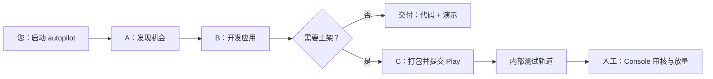

# Hunter–Craftsman 项目说明（甲方 / 非技术版）

> 适用读者：业务负责人、产品经理、甲方决策人  
> 技术细节见 [project-summary.md](project-summary.md) · 操作手册见 [operator-step-by-step-guide.md](operator-step-by-step-guide.md)

---

## 1. 这个项目是做什么的？

**一句话：** 这是一套「从想法到 Google Play 上架」的自动化流水线。您只需下达启动指令，系统会自动完成：**找应用机会 → 设计最小可行产品（MVP）→ 编写 Android 应用 → 生成商店素材 → 可选提交到 Play 商店内部测试轨道**。

可以把它理解为三位分工明确的「数字员工」：

| 角色 | 通俗说法 | 主要工作 |
|------|----------|----------|
| **Agent A（Hunter）** | 市场调研员 | 在 Google Play 上搜索、筛选有机会的轻量工具类应用方向 |
| **Agent B（Craftsman）** | 开发工程师 | 生成 Android 应用代码、界面、图标、截图与演示页 |
| **Agent C（Publisher）** | 上架专员 | 打包安装包、填写合规信息、提交 Play 商店（默认先走「演练模式」） |

---

## 2. 您能得到什么交付物？

一次完整运行后，系统通常产出：

| 交付物 | 说明 |
|--------|------|
| **Android 应用工程** | 可编译的 Kotlin / Jetpack Compose 项目 |
| **应用图标与截图** | 用于 Play 商店展示 |
| **隐私政策网页** | 自动部署到 Cloudflare Pages（替换占位链接） |
| **Play 商店文案** | 标题、副标题、描述、关键词 |
| **上架操作清单** | 逐步说明还需在 Google Play Console 人工完成的步骤 |
| **Android 安装包（AAB）** | 在配置密钥后，可提交至 Play **internal（内部测试）** 轨道 |

默认情况下，**不会直接对公众发布**——系统先以「演练模式（dry-run）」验证整条链路，避免误操作。

---

## 3. 典型使用场景

**场景 A：全自动探索（推荐演示）**

```text
您：启动 autopilot
系统：自动搜索 Play 机会 → 选定一个方向 → 开发 MVP → 可选走一遍上架流程（演练）
```

**场景 B：指定需求**

```text
您：「做一个离线番茄钟，面向学生专注计时」
系统：按描述实现应用，并可选择提交 Play 内部测试
```

**适合：** 快速验证产品方向、批量试探轻工具类应用、降低从 0 到 1 的人力成本。  
**不适合：** 复杂社交/金融/重度游戏、强合规行业（医疗、儿童等需额外人工审核）。

---

## 4. 您需要准备什么？（一次性配置）

真正「Live 上架」前，甲方/运维需提供以下账号与密钥（技术同事按清单配置即可）：

| 项目 | 用途 | 是否必需 |
|------|------|----------|
| **DeepSeek API 密钥** | AI 分析与写代码 | ✅ 必需 |
| **Tavily API 密钥** | 自动搜索 Play 机会 | ✅ 全自动模式必需 |
| **Google Play 开发者账号** | 上架 Android 应用 | Live 上架必需 |
| **Play 服务账号 JSON** | 程序代您上传安装包 | Live 上架必需 |
| **Android 签名证书（Keystore）** | 应用正式签名 | Live 上架必需 |
| **Cloudflare 账号与 Token** | 托管隐私政策网页 | Live 上架推荐 |
| **Docker Desktop（Windows）** | 在无本地 Android SDK 时完成真编译 | 真编译推荐 |

详细勾选清单见：[Play Console 上架清单](play-console-setup-checklist.md)

---

## 5. 流程示意（非技术版）



**重要说明：**

- Google Play **首次创建应用、填写合规问卷、添加测试人员** 等步骤，目前仍需人工在 Play Console 完成；系统会生成 **`play_console_setup.txt`** 逐步指引。
- 隐私政策 URL 若为占位符，系统会自动生成并部署真实页面，减少因链接无效被拒审的风险。

---

## 6. 质量与可靠性（您关心的「稳不稳」）

| 能力 | 现状 |
|------|------|
| 自动化测试 | 全仓库 **147 项测试通过**（可持续回归） |
| 默认超时 | 全自动模式预算 ≥ **30 分钟**，适配 Docker 冷启动与多轮修复 |
| 发布方式 | 提交后立即返回，后台完成打包上传，**不阻塞**其他查询 |
| 失败重试 | 编译失败自动修错；机会不合适时自动换方向（最多 3 次） |
| 演练模式 | 默认 **dry-run**，确认无误后再切换真上架 |

---

## 7. 能力边界（诚实说明）

**我们承诺能做的：**

- 轻量工具类 Android MVP 的快速生成与迭代
- 在密钥齐备时，提交至 Play **internal** 测试轨道
- 自动生成商店素材、隐私页、上架清单，降低运营摩擦

**我们不做保证的：**

- 应用一定盈利或通过 Play **正式版** 审核
- 一次运行即产出复杂商业级产品
- 代替律师/合规团队出具法律意见
- 签名证书丢失后的恢复（需甲方自行备份 Keystore）

---

## 8. 成本与资源（粗略参考）

| 类型 | 说明 |
|------|------|
| **API 费用** | DeepSeek、Tavily 按调用量计费；单次 autopilot 通常为若干次 LLM 调用 |
| **Google Play** | 开发者账号一次性注册费（以 Google 官网为准） |
| **Cloudflare Pages** | 隐私页托管，免费档通常足够 MVP |
| **服务器** | 默认本机运行；生产可部署至 Linux + Docker |

---

## 9. 建议的验收方式

甲方验收时可按以下顺序检查（无需懂代码）：

1. **打开运维界面：** 按 [操作指南](operator-step-by-step-guide.md) 启动 Craftsman + Dashboard；浏览器可看到流水线五步进度（发现 → 上架）。
2. **演示全自动：** 执行 `hunter autopilot --publish --timeout 1800`，终端会打印 **Dashboard 链接**；界面五步均完成，发布步显示 **dry-run 完成**。
3. **检查交付文件夹：** `craftsman/workspace/` 下应有完整工程与 `artifacts/` 素材、演示页或截图。
4. **演练上架：** 确认 CLI/界面终态为 **dry_run_complete**，且生成 **Play 操作清单**（`play_console_setup.txt`）。
5. **（可选）真上架：** 按 [Play 清单](play-console-setup-checklist.md) 配置密钥后，在 internal 轨道看到新版本。

技术同事可用 [project-summary.md §10](project-summary.md) 做分层验收（pytest → dry-run 闭环 → 可选 live）。

---

## 10. 文档与联系人

| 文档 | 读者 |
|------|------|
| [client-overview.md](client-overview.md) | **本文 — 甲方 / 业务** |
| [project-summary.md](project-summary.md) | 技术负责人 / 代码审查 |
| [operator-step-by-step-guide.md](operator-step-by-step-guide.md) | 运维 / 实施同事 |

**仓库地址：** [github.com/killua3333/hunter-craftsman](https://github.com/killua3333/hunter-craftsman)

---

*文档版本：2026-06-01 · 含 Pipeline Dashboard 运维与闭环验收*
