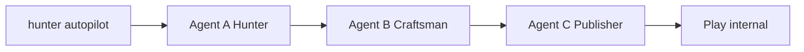

# Hunter–Craftsman 项目总结（审查用）

> 最后更新：2026-06-05  
> 执行依据：Master Roadmap（`hunter_craftsman_master_9a313be6.plan.md`，Cursor Plans 目录）

---

## 1. 一句话

**人类只下启动指令 → 系统自动发现 Play 机会 → 实现 Android MVP → 可选发布到 Play internal track。**

核心命令：

```powershell
hunter autopilot              # 全自动发现 + 实现
hunter autopilot --publish    # 上述 + Agent C 发布（默认 dry-run）
```

---

## 2. 仓库顶层结构

```
hunter-craftsman/
├── hunter/          Agent A — 机会发现、编排、CLI
├── craftsman/       Agent B（实现）+ Agent C（发布）— 同一 FastAPI 服务
│   └── craftsman/publisher/   Agent C 代码
├── scheduler/       Windows 自动调度（循环 → health check → autopilot → 休眠）
├── docs/            操作与架构文档（本文件为入口）
├── docker/          Android CI 构建镜像（Gradle verified）
├── pytest.ini       根目录全量测试配置
├── conftest.py      根目录 pytest 导入路径引导
├── README.md        快速开始（简版）
└── .gitignore       忽略 workspace / callbacks / secrets / .env
```

| 目录 | 智能体 | 不应提交 Git |
|------|--------|----------------|
| `hunter/` | **Agent A** | `.env`、`feedback/*.json`（examples 除外） |
| `craftsman/`（`orchestrator/` 等） | **Agent B** | `.env`、`workspace/`、`callbacks/`、`*.db`、`secrets/` |
| `craftsman/craftsman/publisher/` | **Agent C** | （同上，与 B 共用配置与运行时） |
| `docs/` | — | — |
| `docker/` | — | — |

---

## 3. 三智能体分工



| Agent | 职责 | 技术 | 关键路径 |
|-------|------|------|----------|
| **A Hunter** | Play 机会发现、requirement、A→B→C 编排 | LangGraph ReAct | `hunter/src/hunter/orchestrator/pipeline.py` |
| **B Craftsman** | Soft Gate、scaffold、verify、产物、handoff | FastAPI + 阶段状态机 | `craftsman/craftsman/orchestrator/pipeline.py` |
| **C Publisher** | bundleRelease、签名、Play Edits API | 确定性 orchestrator | `craftsman/craftsman/publisher/` |

详细架构见 [agent-c-architecture.md](agent-c-architecture.md)。

---

## 4. Agent A（Hunter）— 目录说明

```
hunter/
├── prompts/
│   ├── specialist_discovery.md   Autopilot 专用（弱审查、默认 accepted）
│   ├── specialist_system.md      手动 chat/run 路径（已对齐 v2 弱审查）
│   ├── specialist_learnings.md   周报 learnings（hunter learn）
│   └── inline_learnings.md       运行时追加（失败即时注入，可自动生成）
├── src/hunter/
│   ├── agents/specialist.py      SpecialistSession + DiscoverySession
│   ├── tools/
│   │   ├── play_scraper.py       Play 真实数据工具集（核心，const）
│   │   │   ├── play_search_apps        搜索 app 列表
│   │   │   ├── play_get_reviews        读取真实评论
│   │   │   ├── play_get_app_detail     完整元数据
│   │   │   ├── play_analyze_reviews    批量差评聚类分析（痛点频率+典型原文+功能期望）
│   │   │   └── play_competitive_analysis 竞品横向对比（stal/ripe 标记）
│   │   ├── play_search.py        Tavily + site:play.google.com
│   │   ├── play_category_scan.py 工具/效率/健康类目轮询
│   │   └── tavily_search.py      通用 web_search
│   ├── orchestrator/pipeline.py  run_autopilot_pipeline / run_blueprint_pipeline
│   ├── integrations/
│   │   ├── craftsman.py          analyze / implement / 轮询 run
│   │   └── publisher.py          prepare → approve → submit → poll 终态
│   └── main.py                   CLI：autopilot / run / chat / learn
├── tests/                        48 passed
└── .env.example                  DEEPSEEK + TAVILY 必填（autopilot）
```

**Autopilot 行为摘要（v2 — 2026-06）：**

- 无人类需求 → `DiscoverySession` + `play_competitive_analysis`（竞品矩阵） + `play_analyze_reviews`（差评聚类）
- 自动生成 `product_brief`（target_users / pain_points / differentiation / feature_priority）
- 基于差评痛点生成差异化 Store 描述文案
- 解析后强制 `accepted=true`
- 实现失败最多 **pick 3 个机会**；失败写入 `inline_learnings.md`
- 编排 outcome 带 `correlation_id`（= run_id）

---

## 5. Agent B + C（Craftsman）— 目录说明

```
craftsman/
├── craftsman/                    Python 包
│   ├── api/app.py                FastAPI：/v1/opportunities、/v1/runs、/v1/releases、/health
│   ├── gate.py                   Soft / Strict 双模式 Gate
│   ├── requirement_normalize.py  soft_fill + shrink_requirement_scope（失败重试）
│   ├── orchestrator/
│   │   ├── pipeline.py           实现状态机 + verification + scope 重试
│   │   └── reflexion.py          Xcode + Gradle 编译修复环
│   ├── runtime/backends.py       demo / macos_xcode / android_gradle / android_gradle_docker
│   ├── publisher/                Agent C：play_store、play_listing、android_build、privacy_policy…
│   └── tools/
│       ├── assets.py             图标生成（LLM SVG / 传统 fallback）、色板、截图（含 benefit 文案）
│       ├── gradle_errors.py      Gradle build.log 解析
│       └── android_smoke.py      Docker 内 monkey 冒烟
├── templates/
│   ├── android-app/              默认平台；Compose UI + gradlew
│   └── ios-app/                  可选 iOS 模板
├── workspace/                    运行时产物（gitignore，按 run_id 分目录）
├── callbacks/                    反馈 JSON 双写目录（gitignore）
├── examples/requirement.sample.json
├── tests/                        99 passed
└── .env.example                  GATE_MODE、SKIP_GRADLE_BUILD、PUBLISHER_DRY_RUN
```

**实现流水线阶段：**

`spec_normalize → plan → codegen → verify → package → complete`

**verification 字段（Agent B 反馈）：**

| 值 | 含义 |
|----|------|
| `demo` | 跳过 Gradle（`SKIP_GRADLE_BUILD=true` 且无 Docker）或仅 web demo |
| `verified` | Docker 或本机 `assembleDebug` 通过；可选 smoke 通过或注明 skip reason |

**真实上架路径（Real Release Path）：**

- **Docker 编译**：`ANDROID_BUILD_BACKEND=auto` + Docker Desktop → 容器内 Gradle，Windows 无需本机 SDK
- **隐私 URL**：占位符 → Cloudflare Pages `{slug}-privacy.pages.dev`（见 [cloudflare-privacy-setup.md](cloudflare-privacy-setup.md)）
- **Play Console 清单**：Agent C 每次 release 生成 `play_console_setup.txt`（包名/素材/问卷勾选建议）
- **冒烟测试**：`ANDROID_SMOKE_TEST=auto` → monkey 50；崩溃触发 Gradle reflexion（最多 2 轮）

**失败韧性：**

- B 侧：implement 失败 → `shrink_requirement_scope` → 自动重试 1 次
- Android 编译：最多 2 轮 Gradle reflexion（解析 build.log + LLM 修 Kotlin）

---

## 6. Master Roadmap 完成度

| 阶段 | 状态 | 内容 |
|------|------|------|
| Layer 0 双 Agent 基座 | ✅ | 契约、异步 run、ExecutionBackend、release_handoff |
| Layer 1 Agent C live 代码 | ✅ | Play API、listing、version bump、gradle wrapper |
| Phase 0 Autopilot + Soft Gate | ✅ | play_search、Discovery、CLI、soft_fill |
| Phase 1 能跑 + 能发 | ✅ | poll 终态、verification、scope 重试、Gradle reflexion、交互 UI、文档 |
| Phase 2 韧性 | ✅ | 多机会 pick、inline learnings、play_category_scan |
| Phase 3 规模化（基础） | ✅ | correlation_id、/health 扩展、Docker builder + smoke |
| **Real Release Path** | ✅ | Docker Gradle、CF 隐私、Console 清单、冒烟 + reflexion |
| **Automation Hardening** | ✅ | 超时预算、隐私 URL 全覆盖、policy 占位符拦截、异步 submit、WAL、多 worker |
| **Agent A 需求升级（v2）** | ✅ | Play scraper 工具集（竞品矩阵+差评聚类）、差评驱动描述、product_brief |
| **App 质量升级（Part B）** | ✅ | LLM 生成 SVG 图标、品类色板、截图增强（benefit 文案+深色背景） |
| **Windows 自动调度** | ✅ | autopilot_loop 循环脚本 + bat 一键启动 + Task Scheduler 注册 |
| **用户 live 验收** | ⏳ | Docker + CF token + Play 密钥 → `hunter autopilot --publish` |

Phase 3 中 **多机会并行队列**、**批量 autopilot** 尚未做（按需后续）。

### 6.1 Automation Hardening（2026-05 已落地）

| 项 | 说明 |
|----|------|
| Hunter 超时 | `run` 默认 600s；`run --autopilot` 最低 1800s；发布 poll 1800s |
| 隐私 URL | 所有 Android 路径（含 demo）在 package 前部署 CF Pages |
| Policy | 拒绝 `example.com` 等占位 privacy URL |
| 异步 submit | `POST /submit` 入队即返；worker 后台执行 Gradle + Play |
| SQLite WAL | 长构建期间 GET 轮询不阻塞 |
| 多 worker | `JOB_WORKER_COUNT`；stop join 30s |
| LLM / 磁盘 | 单次请求 120s 超时；workspace 剩余磁盘 < 8GB 预检失败 |
| 根目录 pytest | `pytest.ini` + `conftest.py` → 147 tests 一条命令全绿 |

---

## 7. 配置速查

### Hunter `hunter/.env`

```env
DEEPSEEK_API_KEY=...          # 必需
TAVILY_API_KEY=...            # autopilot 必需
CRAFTSMAN_API_TOKEN=...       # 可选，与 Craftsman 一致
```

### Craftsman `craftsman/.env`

```env
GATE_MODE=soft
GATE_AUTO_ACCEPT=true
ANDROID_BUILD_BACKEND=auto       # Docker 可用时真编译
SKIP_GRADLE_BUILD=false          # 配合 Docker auto；无 Docker 时可 true
PRIVACY_DEPLOY_DRY_RUN=true      # live 时 false + CF token
PUBLISHER_DRY_RUN=true           # live 上架时 false
ANDROID_RELEASE_TRACK=internal
DEEPSEEK_API_KEY=...
```

### Live 上架额外配置（用户 P0）

见 [play-console-setup-checklist.md](play-console-setup-checklist.md)：

- `play-sa.json` + Console 授权 Service Account
- `release.jks` + `ANDROID_KEY_*`
- Docker Desktop + builder 镜像（Windows 真编译，见 [docker-android-ci.md](docker-android-ci.md)）
- Cloudflare Pages token（隐私 URL，见 [cloudflare-privacy-setup.md](cloudflare-privacy-setup.md)）
- Console 首次建 app + 问卷 + internal 测试员（Agent C 输出 `play_console_setup.txt` 辅助）

---

## 8. 日常操作

```powershell
# Terminal 1 — Agent B/C 服务
cd d:\A\hunter-craftsman\craftsman
python -m craftsman.cli serve

# Terminal 2 — 全自动（推荐）
cd d:\A\hunter-craftsman\hunter
hunter autopilot --publish

# 或者 Windows 自动调度（无需手动触发）
cd d:\A\hunter-craftsman\scheduler
python autopilot_loop.py --interval 30

# 手动描述需求（仍支持）
hunter run "做一个离线番茄钟" --publish

# 多轮对话 + /make
hunter chat

# 控制台 Dashboard（浏览器打开）
start http://127.0.0.1:8791
```

健康检查：`GET http://127.0.0.1:8791/health`（含 gate_mode、runs_total）

---

## 9. 文档索引

| 文档 | 用途 |
|------|------|
| **[project-summary.md](project-summary.md)** | **本文件 — 技术审查总览** |
| **[client-overview.md](client-overview.md)** | **甲方 / 非技术版 — 价值、交付、验收** |
| [operator-step-by-step-guide.md](operator-step-by-step-guide.md) | 分步操作（含 Autopilot 章节） |
| [play-console-setup-checklist.md](play-console-setup-checklist.md) | Play 真上架一次性配置 |
| [cloudflare-privacy-setup.md](cloudflare-privacy-setup.md) | Cloudflare 隐私政策部署 |
| [agent-c-architecture.md](agent-c-architecture.md) | Agent C 模块与 A→B→C 数据流 |
| [docker-android-ci.md](docker-android-ci.md) | Docker builder 真编译 + smoke |
| [windows-scheduler-guide.md](windows-scheduler-guide.md) | Windows 自动调度指南 |
| [frontend-foolproof-guide.md](frontend-foolproof-guide.md) | Dashboard 傻瓜操作说明 |
| [business-model-ai-remission-analysis.md](business-model-ai-remission-analysis.md) | AI 赚钱赎身 模式可行性分析 |
| [execution-runtime-ops.md](execution-runtime-ops.md) | 运行时 / backend pool |
| [secret-management-plan.md](secret-management-plan.md) | 密钥 provider 策略 |
| [archive/legacy-plans/](archive/legacy-plans/) | 历史架构计划（只读归档） |

---

## 10. 测试与质量

| 包 | 测试数 | 命令 |
|----|--------|------|
| **全仓库** | 147 passed, 1 skipped | `python -m pytest -q`（仓库根目录） |
| Craftsman | 99 passed | `cd craftsman && python -m pytest tests/` |
| Hunter | 48 passed | `cd hunter && python -m pytest tests/` |

代表性 E2E 测试：

- `hunter/tests/test_autopilot_publish_e2e.py` — autopilot + publish dry-run（mock）
- `craftsman/tests/test_e2e_publish.py` — Agent C 发布链
- `craftsman/tests/test_docker_android_runner.py` — Docker Gradle runner mock
- `craftsman/tests/test_privacy_policy_deploy.py` — CF Pages mock
- `craftsman/tests/test_play_console_sheet.py` — Console 操作清单快照

---

## 11. 能力边界（对外口径）

**已具备：**

- 零需求输入 → 自动发现 1 个机会 → Soft Gate → B 实现 → C dry-run/live（密钥就绪）
- internal track 同包名 versionCode 自动递增
- 审查宽松：schema 合法即推进，缺项 auto-normalize

**不承诺：**

- 选品商业最优、复杂 app 一次成功
- Production 过审、Console 首次建 app / 合规问卷
- Keystore 丢失恢复

---

## 12. 审查时可重点看的文件

| 关注点 | 文件 |
|--------|------|
| Autopilot 入口 | `hunter/src/hunter/main.py` |
| 发现 + 多机会重试 | `hunter/src/hunter/orchestrator/pipeline.py` |
| 发布 poll 闭环 | `hunter/src/hunter/integrations/publisher.py` |
| Soft Gate | `craftsman/craftsman/gate.py` |
| 实现 + verification | `craftsman/craftsman/orchestrator/pipeline.py` |
| Android UI 模板 | `craftsman/templates/android-app/.../MainActivity.kt.j2` |
| Play 上传 | `craftsman/craftsman/publisher/play_store.py` |

---

## 13. 运行时产物说明（不必进 Git）

| 路径 | 内容 |
|------|------|
| `craftsman/workspace/{run_id}/` | 工程源码、截图、demo.html、build.log |
| `craftsman/callbacks/` | Agent B 反馈 JSON |
| `craftsman/craftsman.db` | run 队列与 release 状态 |
| `hunter/feedback/` | Hunter 保存的反馈副本 |

清理开发产物：可删除 `workspace/*` 与 `callbacks/*`（不影响代码）。
